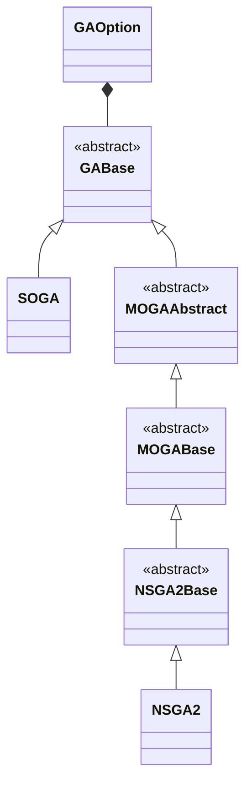

# Genetic algorithm template class

Genetic has some implementations of genetic algorithm solver.

 
 

## Structs/Classes
1. [GAOption](./Genetic/GAOption.md)
2. [GABase](./Genetic/GABase.md)
3. [SOGA](./Genetic/SOGA.md)
4. MOGAAbstract
5. MOGABase
6. NSGA2Base
7. [NSGA2](./Genetic/NSGA2.md)

## Class diagram
